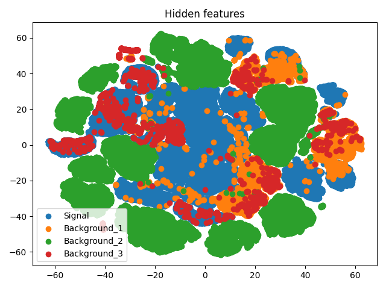

# HEP-AnomalyDetection

### To install required packages :
```bash
pip install -e .
```

### Dataset: :
``` bash
- add root files to {root_path}/merged/{campaigns}/
```

### To train :
```bash
python main.py --num_gpus (num_gpus) --config (path to config file)
```

### Results:
- ROC Curve
- TSNE plot for latent space
- Tensorboard logs: To generate plots `tensorboard --logdir <path to log dir>`

#### Note: Sample config file is provided: config.ini

### Current feature plot:


